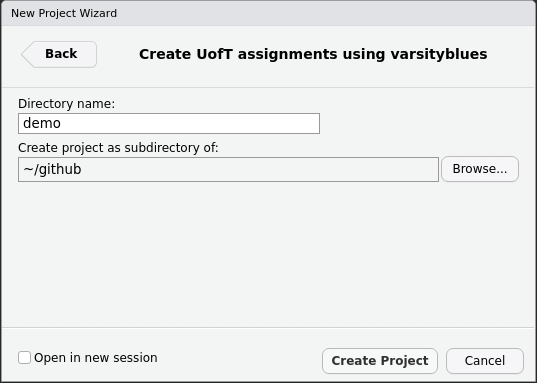

# varsityblues 

<!-- badges: start -->
[](https://github.com/pachadotdev/varsityblues/actions)
<!-- badges: end -->
  
## About

A package for writing assignments at the University of Toronto based off the 
[thesisdown](https://github.com/ismayc/thesisdown) and 
[beardown](https://github.com/kelseygonzalez/beardown) R packages.

This package is heavily inspired by years of LaTeX tricks I learned at the
Catholic University of Chile and the late professor Kim C. Border.

Thanks a lot to Kelsey Gonzalez for polishing beardown, it made creating
varsityblues much more simple!

See an example **document** output in 
[RMD](https://github.com/pachadotdev/varsityblues/blob/main/demo/assignment1/assignment1.rmd) and [PDF](https://github.com/pachadotdev/varsityblues/blob/main/demo/assignment1/assignment1.pdf).

See an example **document** output in 
[RMD](https://github.com/pachadotdev/varsityblues/blob/main/demo/presentation1/presentation1.rmd) and [PDF](https://github.com/pachadotdev/varsityblues/blob/main/demo/presentation1/presentation1.pdf).

## Using varsityblues

1) Install the varsityblues package. Note that varsityblues is not available on CRAN and that you will be installing from an unofficial source which is my GitHub repository.

```r
install.packages("varsityblues", repos = "https://pachadotdev.r-universe.dev")
```

2) Click *File -> New Project -> New Directory -> UofT assignments using varsityblues* in RStudio's top bar.

Note that you may need to restart RStudio at this point if the dialog didn't show up.



3) Edit `assignment1`'s contents for your first assignment. To render your assignment into a PDF, open the `rmd` file inside the `assignment1` directory in RStudio and then click the "knit" button. The PDF file of your thesis will be deposited in the same directory.

4) Copy `assignment1` for the 2nd, 3rd, ..., Nth assignment

5) Profit!

## Components

The following components are ones you should edit to write your assignments:

### `index.Rmd`

This file contains all the meta information that goes at the beginning of your
document. You'll need to edit the top portion of this file (the YAML) to put your name on the first page, the title, etc.

### `bib/`

Store your bibliography (as bibtex files) here. We recommend using the [citr addin](https://github.com/crsh/citr) and [Zotero](https://www.zotero.org/) to efficiently manage and insert citations.

### `csl/`

Specific style files for bibliographies should be stored here. A good source for
citation styles is https://github.com/citation-style-language/styles#readme.

### `figure/` and `data/`

Store your figures and data here and reference them in your R Markdown files. See the [bookdown book](https://bookdown.org/yihui/bookdown/) for details on cross-referencing items using R Markdown.

## Troubleshooting

1) The varsityblues templates shall detect existing LaTeX install or shall install a minimal version that just works when you knit the document.
2) Ensure that you have already installed LaTeX on ytour system and that you are using the latest version of [RStudio](https://www.rstudio.com/products/rstudio/download/).

## Using wihout RStudio

You can use `varsityblues` without RStudio. For example, you can write the Rmd files in your favourite text editor (e.g. [Atom](https://atom.io/), [Notepad++](https://notepad-plus-plus.org/)). But RStudio **is** the easiest tool for writing both R code and text in your assignment. It also provides a nice way to build your documents while editing.

## (Totally optional) Install lucimatx

`lucimatx` provides better typography but it's a paid package. Install it 
under `~/.TinyTeX/texmf-local`.

The steps that worked for me are:
```
cd ~/.TinyTeX/texfmf-local
unzip ~/Downloads/lucida-type1.zip
unzip ~/Downloads/lucimacros.zip
mktexlsr
updmap-sys --enable Map=lucida.map
updmap-sys
```
