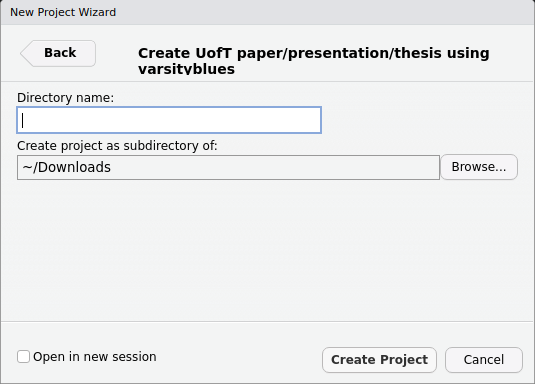

# varsityblues 

<!-- badges: start -->
[](https://github.com/pachadotdev/varsityblues/actions)
<!-- badges: end -->
  
## About

A package for writing UofT papers, presentations and thesis using Quarto.

This package aims to encourage reproducible research and better reproducibility
practices using simple Markdown syntax while embedding all of the R code to
produce plots and analyses as well.

This R package will conduct all the steps required to create a pdf document,
including installing LaTeX if needed.

See https://github.com/pachadotdev/lucida-minion-tex to install a better font
for your documents.

## Acknowledgements

This is based on [thesisdown](https://github.com/ismayc/thesisdown), 
[beardown](https://github.com/kelseygonzalez/beardown) R packages, and
years of LaTeX tricks I learned at the Catholic University of Chile and the late
professor Kim C. Border.

Thanks a lot to [Kelsey Gonzalez](https://github.com/kelseygonzalez) for
polishing beardown, it made creating varsityblues much more simple!

## Examples

See an example **paper** output in 
[qmd](https://github.com/pachadotdev/varsityblues/blob/main/inst/extdata/paper/paper.qmd) and [pdf](https://github.com/pachadotdev/varsityblues/blob/main/inst/extdata/paper/paper.pdf).

See an example **presentation** output in 
[qmd](https://github.com/pachadotdev/varsityblues/blob/main/inst/extdata/presentation/presentation.qmd) and [pdf](https://github.com/pachadotdev/varsityblues/blob/main/inst/extdata/presentation/presentation.pdf).

See an example **thesis** output in
[qmd](https://github.com/pachadotdev/varsityblues/blob/main/inst/extdata/thesis/thesis.qmd) and [pdf](https://github.com/pachadotdev/varsityblues/blob/main/inst/extdata/thesis/thesis.pdf)

## Using varsityblues

1) Install the varsityblues package. Note that varsityblues is not available on CRAN and that you will be installing from an unofficial source which is my GitHub repository.

```r
remotes::install_github("pachadotdev/varsityblues")
```

2) From the R terminal

```r
varsityblues::start_project()
```

Otherwise, click *File -> New Project -> New Directory -> UofT paper/presentation/thesis using varsityblues* in RStudio's top bar.

Note that you may need to restart RStudio at this point if the dialog didn't show up.



3) Edit `paper`'s contents. To render your paper into a pdf, open the `qmd` file inside the `paper` directory in RStudio and then click the "render/knit" button. The pdf file of your paper will be created in the same directory.

The same steps apply to presentations and thesis.

You can copy and paste the `paper`/`presentation`/`thesis` directory to create a new paper/presentation/thesis as many times as you want and it will be lightweight because the tex files are not duplicated.

You can also edit the contents of the `tex` folder, but beware that the changes will after any new paper/presentation/thesis that you create.

## Components

### `paper/paper.qmd`

Ready to use template to create a pdf document. You'll need to edit the top portion of this file (the YAML header) to put your name, the title, etc and then you can start writing your paper.

### `presentation/presentation.qmd`

Ready to use template to create a pdf presentation. You'll need to edit the top portion of this file (the YAML header) to put your name on the title slide and then you can start writing your presentation.

### `thesis/thesis.qmd`

Ready to use template to create a pdf thesis according to UofT design rules. You'll need to edit the top portion of this file (the YAML header) to put your name, the title, etc and then you can start writing your thesis.

### `bib/`

Store your bibliography (as bibtex files) here. I recommend using the [citr addin](https://github.com/crsh/citr) and [Zotero](https://www.zotero.org/) to efficiently manage and insert citations.

### `csl/`

Specific style files for bibliographies should be stored here. A good source for
citation styles is https://github.com/citation-style-language/styles#readme.

### `figure/` and `data/`

Store your figures and data here and reference them in your R Markdown files. See the [bookdown book](https://bookdown.org/yihui/bookdown/) for details on cross-referencing items using R Markdown.

## Troubleshooting

1) The varsityblues templates shall detect existing LaTeX install or shall install a minimal version that just works when you knit the document.
2) Ensure that you have already installed [Quarto](https://quarto.org). I moved everything to Quarto because it is easier to use.

## Using wihout RStudio

You can use `varsityblues` without RStudio. For example, you can write the qmd files in your favourite text editor (e.g. Visual Studio Code).

## (Totally optional) Install lucimatx

`lucimatx` provides better typography but it's a paid package. Install it 
under `~/.TinyTeX/texmf-local`.

The steps that worked for me are:
```
cd ~/.TinyTeX/texfmf-local
unzip ~/Downloads/lucida-type1.zip
unzip ~/Downloads/lucimacros.zip
mktexlsr
updmap-sys --enable Map=lucida.map
updmap-sys
```
